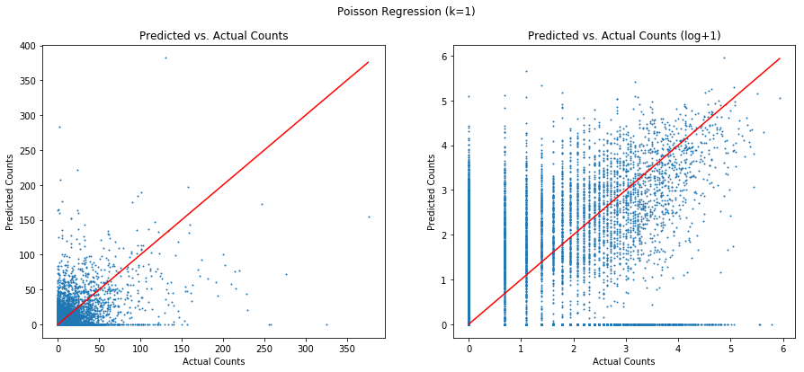

# Meeting Summary (1-18-2018)

There were two main conclusions from the meeting regarding the fire count prediction problem (these do not apply to Shane's project).
1. We will be testing a cell-based (grid-based) approach to the fire counts prediction. 
2. We will be prioritizing exploring Poisson regression over quantile regression.

## Cell-based Approach
We would like to experiment with the cell-based approach because it simplifies the model and removes the dependence on the hyper-parameter selection for the clustering. In a cell-based approach the model would learn to predict the next day's counts for each cell using the weather and counts from the same cell on the previous day. The model's parameters would be shared for all cells (so each cell doesn't learn a unique model), but each cell would have a unique bias/intercept.

This approach is in contrast to the current method which employs a hybrid cluster/cell approach. In the current approach, predictions are made from the active fire clusters and then the counts attributed to cells based on the cluster's position. The current method has a few drawbacks and we will be able to evaluate if switching to a cell-only produces improved results.

A cell-based approach could use a regression model of one of the following forms.

1. Single Poisson Regression
This method learns a single model to capture the counts from the active fires and ignitions. 

2. Multiple Poisson Regressions
This method learns a separate model for the active fires and the ignitions. It was also brought up that a third model could be trained to account for counts that are the result of fires in neighboring cells moving into a cell. Most likely the active fire model will capture the vast majority of counts.

3. Zero-inflated Poisson Regression
This method uses a different formulation of Poisson Regression in which we are better able to account for the large number of zero counts found in the data. Empirically, the amount of zero counts exceeds that which you would expect to find in a regular Poisson distribution. 

## Not Applying Quantile Regression
Based on the results of tests with quantile regression, it doesn't appear that this method is appropriate for the task. Because a given cell on a given day is most likely to have zero fires, the quantile regression (for q=.5) tends to learn to predict a value that is very close to zero under most conditions. 

In the plots on the following page we compare the predicted counts from the model versus the actual counts observed. The left plots are in regular space and the right plots in log space (with 1 added to the values so 0 values don't produce neg. infinity). The top plots are from Poisson Regression and the bottom from quantile regression. We can see that quantile regression learns to predict a much more narrow range of values than Poisson regression and is heavily biased to predict under the actual number of detections. 

While we believe that quantile regression may not be optimal for the counts prediction problem, it still is very relevant to the final fire size prediction problem.

  
